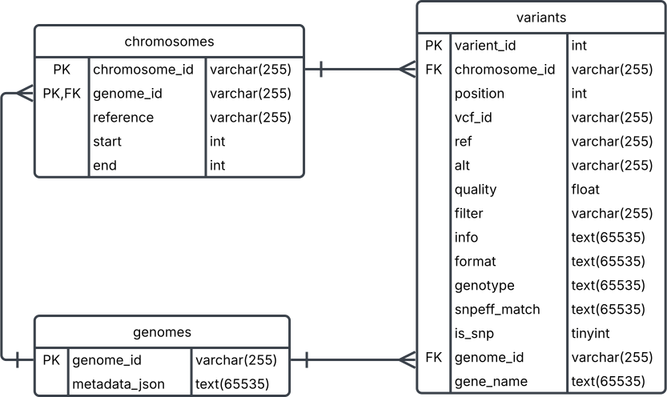

<h1>Schema Technical Documentation</h1>

Technical Documentation is best viewed from GitHub. See <a hfre='https://github.com/ms2206/GenomeVarAPI/tree/main'>https://github.com/ms2206/GenomeVarAPI/tree/main</a>.

<h2>Overview</h2>
The database consists of 3 tables: genomes, variants and chromosomes. 

<h3>Genomes Table</h3>
This table contains the genome_id and is unique to the VCF file. This column is the primary key for this table. This table is useful
for interacting with file-level queries - e.g. how many SNPs are in this file/gemone_id.

Many of the API endpoint start with api/genomes.

gemone_id was chosen as a natural surrogate key.

metadata_json contains the metadata which can also be access for each file, as shown 
<a href='http://localhost:3000/api/genomes/RF_041/'>here</a>.

Both columns are mandatory.

<h3>Variants Table</h3>
This table is the main bulk for the VCF file and contains detailed information from the variants. It is not in 3NF - by design - to keep the database schema more simplified. The primary key is an autogenerated integer that is created upon import. 

This table has foreign keys to both the chromosomes and genomes tables.

This table contains all the information from the VCF file, some of the columns are nested as JSON objects for simplicity for the python app to parse. This was a design decision to keep the parsing tool simple, whilst still giving the user access to the data is required. Future revisions may look to flatten some of these structures. <code>is_snp</code> column identifies if a variant is a SNP or INDEL. <code>snpEff</code> and <code>gene_name</code> can be NULL, all other columns are required.

<h3>Chromosomes Table</h3>
This table serves more as a helper table used to identify start and stop points for each chromosome. It's main purpose is to help generate an end point that the user can query to list genes impacted by moderate or high/moderate impact variants in a <u>specific chromosome region</u> for a specific VCF {genome_id}. See <a href='http://localhost:3000/api/genomes/RF_041/chr04/20'>here</a> for an example.

The chromosome table makes use of the <code>chromosome_id</code> and <code>genome_id</code> as it's primary key. All columns are mandatory.

<h3>Entity Relationship</h3>

<h3>Initialize the database</h3>
If following a non-standard set up, a schema <code>src/db/schema.sql</code> script is provided which contains table declarations for the database. 

To run this file execute the below code: <code>sqlite3 src/db/vcf_db.sqlite3 < src/db/schema.sql</code>

To manually load the database with test data run: <code>sqlite3 src/db/vcf_db.sqlite3 < src/db/dummy_load.sql</code>

To find exploratory SQL examples see:<code>src/db/playground.sql</code>

To re-create the ER diagram the file <code>src/db/mysql_schema_for_ER_only.sql</code> can be used. This is the scheme, but written in mysql which is more transportable for ER visualization tool like MySQL Workbench or LucidChart.

<h2>Documentation</h2>
<ul>
<li><a href='./user_guide.md'>User Documentation</a></li>
<li><a href='./database_technical_docs.md'>Database Technical Documentation</a></li>
<li><a href='./parse_vcf_technical_docs.md'>VCF Parser Technical Documentation</a></li>
<li><a href='./server_technical_docs.md'>API Technical Documentation</a></li>
</ul>