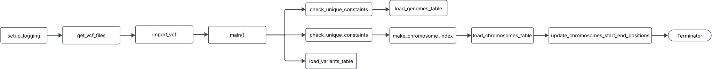

<h1>VCF Parser Technical Documentation</h1>

<h2>Overview</h2>
One of the core features of this tool as a VCF parser written in python `src/utils/parse_vcf.py`.

The python tool requires a virtual environment setup. The tool requires python version 3.9.*.

It is reccomened to use the standard installation from the <a href='./user_guide.md'>User Documentation</a> using the
<code>./src/entrypoint.sh</code>. However, should you will to run this module separately follow the below steps.


```
# Create a virtual environment
python3.9 -m venv genomeVarAPI_pyenv_3.9

# Activate the virtual environment
source genomeVarAPI_pyenv_3.9/bin/activate

# Install the packages using pip
pip install regex
pip install "setuptools<58" --upgrade
pip install pyvcf
```

The python tool `src/utils/parse_vcf.py` can be run using the below command: <br>
```
python src/utils/parse_vcf.py
```

This tool will parse each VCF files in `src/data/raw` and load them to the database `src/db/vcf_db.sqlite3`.

<strong>Note: This step is quite CPU intensive and can take upto 10 minuets.</strong> 

The tool output logs can be found at `src/utils/parse_vcf.log`. The logs are quite verbos but provide the 
user with tools to inspect the inner workings of the python code.

For example:
To identify warning messages;<br>
```
grep "WARNING" src/utils/parse_vcf.log
```
<h2>Design Comments</h2>

Python was chosen as the language of choice for this module, in part because there exist existing libraires to parse VCF files. pysam and pyvcf were considered for this tool. pyvcf was chosen for it's lightweight simplicity. Additionally, Python was preferred over a fully integrated JavaScript front-end/back-end solution due to the developers' greater proficiency with Python.

The tool as it stands represent MPV (minimul viable product) meeting user needs as assigned in the <a href='../I-BIX-DAT Assignment Brief 2025-1.pdf'>Design Brief</a>. There exist known limitions which will be discussed below.

<h5>Use of RegEx</h5>
Parts of the python tool over-rely on RegEx to extract information, especially from the INFO column from the VCF. This limits the tools ability to call annotations. The current release supports parsing VCF files annotated using SnpEff legacy 'EFF' format. The 'ANN' is not yet supported but will be made avaliable in a future release. Considering gene annotations, the tool is limited to extracting gene names for 'mRNA' labeled genes, a future release will expand on these capabilities. <br><em>Note: if your annotations do not follow this format the tool should still complete but their annotations and gene names.</em>

<h5>Use of JSON in the database</h5>
The tool uses JSON to dump some of the more complex data structures from the VCF object. Future releases will handle parsing the INFO, GENOTYPE, and METADATA objects to flatten these structures and provide the user with better access to this data. This was a conscious decision to balance time and effort when developing MVP.

<h5>Duplication of VCF files</h5>
The <code>load_variants_table</code> generates a unique primary on import, which means there is no pre-existing check to test if this variant has alread been added. If the user adds a duplicate VCF file into <code>./data.raw</code> then the <code>genomes</code> table and <code>chromosomes</code> tables will <b>NOT</b> be updated - since these tables have a unique constains check imposed - but the variants <b>WILL</b> be added to the database, causing the SNP/INDEL endpoints to be inaccurate. This is a known <i>feature</i> (😉), and will be fixed in a furture release. The upcomming fix for this will be to generate an MD5 based on 'chromosome_id + ALT + REF' columns and use this hash as the primary key for the variants table. 

Until then, don't add duplicate files... 

<h2>Functions and Design Flow</h2>



<h2>Documentation</h2>
<ul>
<li><a href='./user_guide.md'>User Documentation</a></li>
<li><a href='./database_technical_docs.md'>Database Technical Documentation</a></li>
<li><a href='./parse_vcf_technical_docs.md'>VCF Parser Technical Documentation</a></li>
<li><a href='./server_technical_docs.md'>API Technical Documentation</a></li>
</ul>